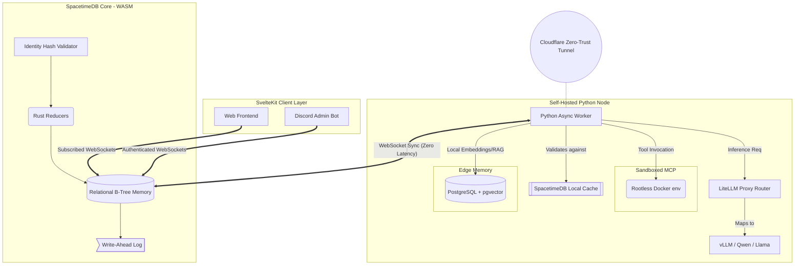

# **The Heiwa Universe: 0-100% Engineering Blueprint & Architecture Master Plan**

> **Objective:** To build a fully autonomous, decentralized, and sovereign AI agent mesh. This document serves as the ultimate source of truth, compiling verified code patterns, deeply researched architectural reasoning, and a sequential implementation plan to build the Heiwa Universe from 0 to 100%.

---

## **1. Architectural Intent & Reasoning**

The Heiwa Universe is born from the realization that traditional 3-tier web architectures (Frontend ↔ REST API ↔ Database) fail when scaled to autonomous AI agent meshes. The overhead of network serialization, the lack of real-time multi-agent state synchronization, and the latency of centralized vector retrieval create insurmountable bottlenecks.

**The Heiwa Paradigm Shifts:**
1. **The Sovereign State Machine (SpacetimeDB):** We collapse the API and Database tiers into a single WebAssembly (WASM) execution environment. Logic is embedded directly in the relational memory space. This mathematically eliminates REST HTTP overhead, guarantees ACID-compliant state mutations across thousands of agents, and pushes real-time updates via multiplexed WebSockets.
2. **Untrusted Edge Compute (The Limbs):** AI inference is non-deterministic, computationally heavy, and highly susceptible to prompt injection. Therefore, LLMs must never execute near the core database. They run as geographically distributed "Limbs" connected via secure, outbound-only Cloudflare Tunnels.
3. **Token Exhaustion Prevention (MCP):** Providing an AI with 100 API tools bloats the context window. We utilize the **Model Context Protocol (MCP)** to provide a single `run_python` tool. The LLM writes dynamic scripts to discover and invoke tools, which execute inside heavily sandboxed, **Rootless Docker** containers.
4. **Edge-Localized Memory (pgvector):** Sending megabytes of raw text across the internet for RAG is cost-prohibitive. Each Limb has its own PostgreSQL database with `pgvector` and HNSW indexing. Limbs query locally, synthesize an answer, and send only a tiny **Summary Payload** back to the SpacetimeDB core.

---

## **2. System Architecture & Topology Diagram**



---

## **3. Verifiable Code & Implementation Patterns**

### **3.1 The Brain (Rust / SpacetimeDB Hub)**
*Reasoning: Enforce multi-tenancy cryptographically and manage state with atomic determinism.*

**`~/heiwa/apps/heiwa_hub/src/lib.rs`**
```rust
use spacetimedb::{table, reducer, view, Identity, ReducerContext, ViewContext};

// 1. Private Table with Cryptographic Identity
#[table(name = organization_tasks, public = false)]
pub struct OrganizationTask {
    #[primarykey]
    #[autoinc]
    pub id: u64,
    pub tenant_id: Identity, // The cryptographic boundary
    pub payload: String,
    pub status: String,
    pub assigned_worker: Option<String>,
}

// 2. View: Restricts row synchronization to the authenticated client/limb
#[view(name = tenant_task_view, public = true)]
pub fn tenant_tasks(ctx: &ViewContext) -> Vec<OrganizationTask> {
    ctx.db.organization_tasks()
       .tenant_id()
       .filter(ctx.sender()) 
       .collect()
}

// 3. Reducer: Atomic state mutation eliminating race conditions natively
#[reducer]
pub fn claim_task(ctx: &ReducerContext, task_id: u64, worker_id: String) -> Result<(), String> {
    let mut task = ctx.db.organization_tasks().id().find(task_id).ok_or("Task not found")?;
        
    if task.status != "pending" || task.assigned_worker.is_some() {
        return Err("Task already claimed by another Limb.".into());
    }
    
    task.status = "claimed".to_string();
    task.assigned_worker = Some(worker_id);
    ctx.db.organization_tasks().id().update(task_id, task);
    
    Ok(())
}
```

### **3.2 The Limb (Python Worker & Cache)**
*Reasoning: AI Workers should never poll. They sync a local SpacetimeDB cache in RAM and execute 0-latency reads.*

**`~/heiwa/apps/heiwa_limbs/worker.py`**
```python
import asyncio
from module_bindings.organization_task import OrganizationTask
from module_bindings.claim_task import claim_task
from module_bindings.spacetime_client import SpacetimeDBAsyncClient

WORKER_ID = "limb-us-east-01"

async def reasoning_loop():
    while True:
        # Zero-Latency Read: Query the local memory, NOT the network
        for task in OrganizationTask.iter():
            if task.status == "pending":
                try:
                    # Fire deterministic reducer across the websocket
                    claim_task(task.id, WORKER_ID)
                    print(f"[{WORKER_ID}] Attempting to claim Task {task.id}")
                    # Await state confirmation from DB before processing...
                except Exception as e:
                    pass # Race condition lost to another limb, gracefully ignore
        await asyncio.sleep(0.1)

# Callback automatically triggered when DB pushes new state
def on_cache_applied():
    print("Local cache synchronized with SpacetimeDB Core.")
    asyncio.create_task(reasoning_loop())

if __name__ == "__main__":
    # Authed Client setup omitted for brevity
    client.run(queries=["SELECT * FROM tenant_task_view"])
```

### **3.3 The Edge Memory (PostgreSQL pgvector)**
*Reasoning: Enable rapid, local similarity search using Hierarchical Navigable Small World (HNSW) graphs.*

**SQL Initialization**
```sql
CREATE EXTENSION vector;

CREATE TABLE document_chunks (
    id BIGSERIAL PRIMARY KEY,
    tenant_identity TEXT NOT NULL,
    content TEXT NOT NULL,
    embedding vector(1536) -- Matches OpenAI / standard embedding sizes
);

-- Optimize with HNSW and Cosine Similarity mapping
CREATE INDEX document_chunks_embedding_idx ON document_chunks 
USING hnsw (embedding vector_cosine_ops) 
WITH (m = 16, ef_construction = 64);
```

---

## **4. The 0-100% Build & Publish Plan**

This plan dictates the exact sequential execution required to transition the `~/heiwa` codebase into production.

### **Phase 0: Monorepo Bootstrapping**
1. Initialize the monorepo directory structure.
   ```bash
   mkdir -p ~/heiwa/apps/{heiwa_hub,heiwa_limbs,heiwa_web,heiwa_cli}
   mkdir -p ~/heiwa/packages/module_bindings/{python,typescript}
   ```
2. Install foundational compilers and tools.
   ```bash
   curl --proto '=https' --tlsv1.2 -sSf https://install.spacetimedb.com | sh
   rustup target add wasm32-unknown-unknown
   ```

### **Phase 1: The Sovereign State Machine (Hub Compilation)**
1. **Develop Schema:** Migrate Actix logic/SurrealDB schemas into Rust `#[table]`, `#[reducer]`, and `#[view]` definitions inside `apps/heiwa_hub/src/lib.rs`.
2. **Publish & Compile:**
   ```bash
   cd ~/heiwa/apps/heiwa_hub
   spacetime publish heiwa_production_db
   ```
   *This commands compiles the Rust logic to WASM, uploads it to the SpacetimeDB host, and initializes the durable Write-Ahead Log.*
3. **Generate API Bindings:**
   ```bash
   spacetime generate --lang python --out-dir ../../packages/module_bindings/python --project-path .
   spacetime generate --lang typescript --out-dir ../../packages/module_bindings/typescript --project-path .
   ```

### **Phase 2: Edge Security & Ingress (Nervous System)**
1. **Cloudflare Tunnel Provisioning:** On the edge server hardware, install `cloudflared`.
2. Configure `~/.cloudflared/config.yml` to establish outbound-only TCP connections, mapping internal ports to `limb01.heiwa.ltd`.
3. Configure host OS firewall (e.g., UFW) to strictly block **all** inbound ports.

### **Phase 3: The Edge Memory (PostgreSQL)**
1. Instantiate local PostgreSQL on the edge hardware.
2. Install and enable the `pgvector` extension.
3. Apply the `CREATE TABLE` and `CREATE INDEX ... USING hnsw` schemas to support local RAG embedding clusters.

### **Phase 4: Sandboxed AI Inference (The Limbs)**
1. **LLM Hosting:** Boot up the `vLLM` engine to serve the foundational model efficiently.
   ```bash
   vllm serve Qwen/Qwen2.5-7B-Instruct --enable-auto-tool-choice --max-model-len 8192
   ```
2. **Rootless Docker Sandbox:** Execute `dockerd-rootless-setuptool.sh`. Allocate subordinate UIDs in `/etc/subuid`.
3. **MCP Initialization:** Deploy the Anthropic Model Context Protocol server. Expose *only* the `run_python` tool. Ensure the execution runtime targets the rootless Docker socket to sandbox adversarial prompt injections.
4. **Worker Execution:** Start the Python worker loop (`worker.py`). The worker authenticates with SpacetimeDB, syncs its cache, and awaits tasks.

### **Phase 5: The Pure Client (The Face)**
1. Inside `apps/heiwa_web/` (SvelteKit), import the generated TypeScript SDK from `packages/module_bindings/typescript`.
2. Replace all HTTP `fetch()` logic with SpacetimeDB WebSocket subscriptions.
3. Bind Svelte stores directly to SpacetimeDB `on_update` callbacks, achieving zero-latency UI reactivity.

### **Phase 6: Cutover & Data Migration**
1. Write a one-off Python migration script.
2. Read the legacy state from the old SurrealDB cluster.
3. Parse the data and fire sequential SpacetimeDB reducers (e.g., `migrate_user`, `migrate_document`) to systematically populate the new sovereign state machine.
4. Decommission the old Actix API layer and SurrealDB nodes.

---
*Blueprint Version: 3.0. Finalized by Gemini Agent for the Heiwa Operator.*