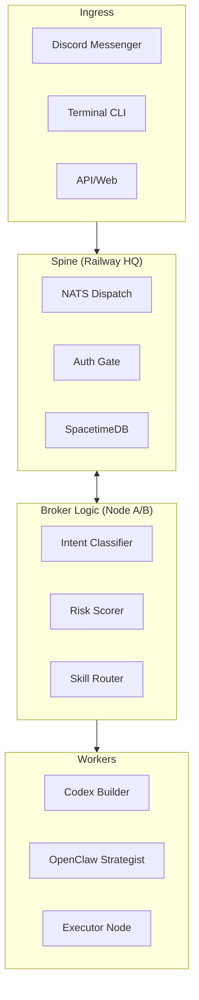

# 🌐 Heiwa Universe `v1.67`

[](https://railway.app)
[](https://spacetimedb.com)
[](https://nats.io)
[-brightgreen?style=for-the-badge)](https://status.heiwa.ltd)

> **Sovereign, 24/7 autonomous AI orchestration mesh.**
> Built for durability, privacy, and multi-node execution across local and cloud surfaces.

---

## 🏔️ Current Operating State: Phase B (Broker Extraction)

The Heiwa Swarm is currently operating under the **March 6, 2026 Enterprise Blueprint**.

| Milestone | Capability | Status |
|:----------|:-----------|:-------|
| **Core v1.0** | Initial agentic loops & NATS dispatcher | ✅ STABLE |
| **Bridge v1.5** | Local-to-Cloud Tailscale connectivity | ✅ STABLE |
| **Identity v1.6** | SpacetimeDB v2 migration & Sovereign Auth | ✅ STABLE |
| **Enterprise v1.67**| **Discord Bridge + Mesh Telemetry + Broker Logic** | ✅ ACTIVE |
| **Phase C** | Policy Engines & Dynamic Budgeting | 🔨 PLANNED |

---

## 🏗️ High-Level Topology



---

## 📂 Repository Topology

* **`apps/heiwa_hub`**: The "Brain" — encompasses agents (Spine, Messenger, Broker), cognition, and main boot logic.
* **`apps/heiwa_cli`**: The high-impact TUI for manual swarm interaction and real-time telemetry.
* **`packages/heiwa_sdk`**: The substrate — contains the DB bridge, vault, state management, and unified config.
* **`packages/heiwa_protocol`**: The shared contract — defining the NATS subject structure and payload schemas.
* **`config/swarm`**: Environmental blueprints, router maps, and hardware constraints.

---

## 🚀 Getting Started (Operator Mode)

### 1. Environment Prep

```bash
# Initialize the mesh
cd ~/heiwa
source .venv/bin/activate

# Setup Pathing
export PYTHONPATH=$(pwd)/packages/heiwa_sdk:$(pwd)/packages/heiwa_protocol:$(pwd)/packages/heiwa_identity:$(pwd)/packages/heiwa_ui:$(pwd)/apps
```

### 2. Local Spin-up

```bash
# Ensure NATS is active locally
nats-server -js &

# Boot the Messenger & Spinal Agents
python -m apps.heiwa_hub.main
```

### 3. Verification Suite

```bash
# Run Classifier Validation (Target: 95%+)
python apps/heiwa_hub/tests/test_intent_classifier.py

# Run Full Mesh Smoke Test
python apps/heiwa_hub/actions/smoke_test_discord.py
```

---

## 📜 Key Enterprise Manifests

| Document | Purpose |
|:---------|:--------|
| [SOUL.md](file:///Users/dmcgregsauce/heiwa/SOUL.md) | **Identity**: Behavioral guidelines and system ethics. |
| [AGENTS.md](file:///Users/dmcgregsauce/heiwa/AGENTS.md) | **Reference**: Architecture, topology, and agent-specific constraints. |
| [BUILD_BLUEPRINT](file:///Users/dmcgregsauce/heiwa/config/swarm/BUILD_BLUEPRINT_2026-03-06.md) | **Strategy**: Current build targets and non-negotiables. |

---

*"Be genuinely helpful, not performatively helpful. Have opinions. Actions speak louder than filler words."* — **HEIWA SOUL**
