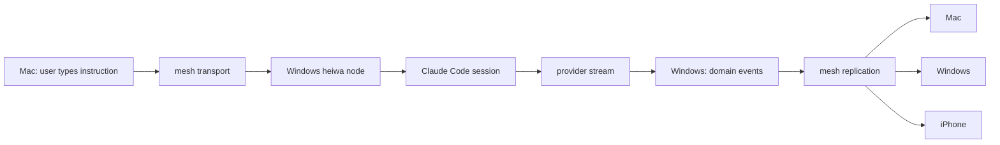

# Heiwa Mesh Runtime Design

Date: 2026-08-20
Status: Accepted — D1 ratified by Devon on 2026-08-20
Plane: Intake + Execution + Evidence
Supersedes: `2026-08-14-heiwa-app-product-roadmap-design.md` § L5 and § D1

## Summary

The product thesis moves from **one governed runtime on the user's machine** to
**one governed runtime across the user's machines**.

Every enrolled device contributes what it has — models, provider sessions,
files, accounts, displays, GPU/CPU, and the user's own attention — to one
capability fabric. There is no conceptual master machine. A device that is
always on is an operational convenience, not a topological requirement: if it
disappears, every other node continues to accept, plan, and execute work, and
converges when it returns.

This is not a rewrite. `docs/capability-fabric.md` already models devices,
models, accounts, agents, policies, and evidence as typed resources.
`crates/heiwa_a2a` already types `AgentIdentity { node, class, provider, model,
locality }`, `Task`, `RiskTier`, and `Artifact`. The `node` field exists and is
unpopulated. This document makes the fabric distributed and live by filling in
what the tree already declared, and by adding the four things genuinely absent:
node identity, capability advertisement, replication framing, and a work
container above `Task`.

## What this document does and does not do

**Does:** record the ratified decision D1; define the mesh domain model against
existing crates; reconcile the mesh's partial ordering with the operator
stream's total ordering; state platform limits honestly; specify the first
vertical slice and its acceptance gate.

**Does not:** reorder the layer sequence. L3 (connector plane — Calendar and
Mail first, per AD-14) remains the immediate work, L4 (browser surface) follows.
This document is the L5 specification, written now because L3 and L4 must not
be built in a shape the mesh cannot carry. Its only claim on L3/L4 is a set of
constraints, listed in § Constraints on L3 and L4.

**Does not:** claim any of this is built. Nothing in § Mesh domain model exists
in the tree today except where explicitly marked *(exists)*.

## Verified baseline

Checked against the tree at `362f3648`.

### Exists and is load-bearing for the mesh

| Fact | Location |
|---|---|
| `AgentIdentity` carries `node: String`, `locality: Local \| RemoteTrusted \| RemoteUntrusted`, `provider`, `model` | `crates/heiwa_a2a/src/lib.rs:17` |
| `Task { task_id, context_id, state, from, assignee, messages, artifacts, risk_tier, approval_required }` | `crates/heiwa_a2a/src/lib.rs:61` |
| `RiskTier` T0–T3 with T2 = approval required, T3 = explicit broker | `crates/heiwa_a2a/src/lib.rs:121` |
| `TaskState` including `InputRequired` and `AuthRequired` — the states a human endpoint needs | `crates/heiwa_a2a/src/lib.rs:49` |
| Append-only JSONL journal with envelopes, locking, replay, recovery, compaction | `crates/heiwa_evidence/` |
| Persisted `WorkerSession`, `WorkerLease`, `DispatchAck`, `RunReceipt`, `Artifact` | `crates/heiwa_evidence/src/records.rs` |
| Per-call DREX routing with capability, privacy/risk, quality floor, budget, and five cost-truth classes | `apps/heiwa_shell/src/model_calls.rs`, `crates/heiwa_drex/` |
| `LocalIdentity { installation_id, display_name, created_at }`, idempotent, refuses newer schema | `crates/heiwa_identity/src/lib.rs:30` |
| ConfigRoot as sole per-user state resolver | `crates/heiwa_config/src/lib.rs` |
| PTY/daemon foundation for pane attach, read, send | `crates/heiwa_session/` |
| Runtime supervisor: the bundled app spawns and supervises its own runtime, adopts one already running | L2.5 D-2, ledger |

### Does not exist

- No node keypair. `LocalIdentity` is an opaque string with no signing material.
- No node registry, no capability advertisement, no peer transport.
- No object above `Task`. `context_id` is a free string, not a container.
- No provider-session host affinity. A provider session is implicitly local.
- No surface instance or control lease. Panes are local-only.
- No attention/signal normalization.
- No mobile target. Tauri 2 supports mobile; nothing in the tree targets it.
- Cross-node anything. Every existing remote claim is aspirational.

## D1 resolved — cross-device sync transport

The roadmap left three candidates. Measured against the standing hard rule in
`CLAUDE.md` — *"No hosted authority plane"* — only one survives without a
deliberate policy rewrite.

| Candidate | Verdict |
|---|---|
| 1. User-supplied storage | Viable, but a store-and-forward relay, not a live mesh. Cannot carry session steering. |
| 2. Heiwa Limited sync service | Contradicts the hard rule. Would need Devon to rewrite the rule deliberately, not erode it. |
| 3. Direct device-to-device | **Recommended.** Preserves local-first fully, no third party, and is the only candidate that can carry live session steering. |

**Recommendation: candidate 3 as the transport, candidate 1 as an optional
asynchronous relay** for the case where two nodes are never online together.
The relay carries ciphertext the relay operator cannot read, so it does not
become an authority plane — it is a mailbox, not a source of truth.

Candidate 2 is not refused on merit. It is the least user effort and is what
ChatGPT and Claude desktop do. It is refused because adopting it is a product
policy change, and product policy is Devon's. Devon ratified candidate 3 plus
the optional ciphertext relay on 2026-08-20; no hosted authority plane is
introduced.

Cost accepted with candidate 3: peer reachability is genuinely hard (NAT
traversal, changing networks, sleeping laptops), and both devices must be up
for a live exchange. The relay covers the asynchronous case; nothing covers
"steer a session on a machine that is powered off," and the product must say
so rather than pretend.

### MacBook-first bootstrap

Implementation begins from the machine running Heiwa now, without making that
machine a master:

1. App boot refreshes the local machine manifest and capability/resource
   probes under the resolved configuration root.
2. Runtime snapshot identifies this device as local execution and presentation
   perspective while describing durable user data as shared.
3. Until peer enrolment and replication land, sync status remains explicitly
   `local_only`; UI must not imply another device already has the data.
4. Same contract on Windows produces a Windows-local perspective over the same
   replicated Work/evidence data. Machine capabilities, credentials, process
   handles, and live resource pressure remain node-scoped.

This bootstrap satisfies existing one-machine boot contract and prepares L5
seam. It does not create a node keypair, enrol a peer, or claim cross-device
replication exists.

## Mesh domain model

Five new typed resources, plus two changes to existing ones. Every one is a
plain Rust domain object. None requires novel distributed-systems machinery.

### `MeshNode` — new crate `crates/heiwa_mesh`

An enrolled device. Identity is a keypair minted at enrolment, bound to the
existing `LocalIdentity.installation_id` so credentials and evidence already
attributed to the installation stay attributed.

```rust
MeshNode {
    node_id,              // public key fingerprint, stable
    installation_id,      // existing LocalIdentity, one per node
    display_name,
    platform,             // macos | windows | linux | ios | android
    class,                // FullNode | MobileNode
    enrolled_at,
    last_seen,
    background_reliability, // scheduler input, see Platform truth
}
```

`AgentIdentity.node` (already present, currently unpopulated) becomes a
`node_id`. That single change makes every existing worker, task, and receipt
retroactively node-attributed.

### `CapabilityAdvertisement`

What a node can do *right now*. Republished on change, expires, and is never
trusted stale. This is the live half of the capability fabric.

```rust
CapabilityAdvertisement {
    node_id,
    published_at,
    expires_at,
    model_endpoints: Vec<ModelEndpoint>,
    tools,                 // leasable tool classes present on this node
    surfaces,              // what this node can host or display
    resources,             // repo checkouts, mounted volumes, connected accounts
    load,                  // cpu/gpu/memory pressure
    power,                 // on_mains | battery(pct) | unknown
}
```

### `ModelEndpoint` — widens the DREX candidate

Today DREX selects a model. The candidate tuple becomes:

```text
node × provider × model × account × session
```

```rust
ModelEndpoint {
    node_id,
    provider,              // claude_code | codex | ollama | apple_foundation | anthropic_api | ...
    model,
    account_id,            // existing heiwa_provider account
    session_ref: Option<ProviderSessionId>,  // a warm session with context
    locality,              // reuses heiwa_a2a::Locality
    cost_truth,            // reuses the five existing cost-truth classes
    health,                // reuses heiwa_provider::HealthState
    context_refs,          // e.g. repo checkout this session already holds
}
```

Nothing about DREX's selection *policy* changes: cheapest candidate above the
per-call quality floor, after capability, privacy, risk, and budget gates. What
changes is the candidate set, and three new gate inputs: data locality, session
locality, and node reliability. A candidate on a node that cannot reach the
data is filtered before it competes on cost — the same shape as the existing
health gate from L1 review finding H-2.

### `Work` — the unit above `Task`

This is the largest product change, and the one that escapes provider lock-in
at the UX level.

ChatGPT owns chats. Claude owns Claude sessions. Codex owns coding threads.
**Heiwa owns `Work`.** A provider session is a *resource attached to* a Work,
never the Work itself.

```rust
Work {
    work_id,
    intent,                // what the user actually wants
    status,
    context_refs,
    tasks: Vec<TaskId>,           // existing heiwa_a2a::Task
    provider_sessions,            // host-affine, see below
    artifacts,                    // existing Artifact
    surfaces,
    approvals,
    evidence_refs,
    origin_node,
    coordinator_node,
    revision,
    created_at, updated_at,
}
```

`Task.context_id` — today a free string — becomes the `work_id`. That is the
whole migration for existing tasks.

### `ProviderSession` — host affinity, not fake migration

A live Claude Code process on a Windows node owns a working directory, a
terminal, tool state, and a provider-side session. **It is not copied.** It is
addressed.

```rust
ProviderSession {
    logical_session_id,     // mesh-wide
    provider,
    host_node,              // where the process actually lives
    native_session_ref,     // the provider's own id
    cwd,
    context_refs,
    status,
}
```

Steering from another node is a routed instruction, not a migration:



The provider never learns it is being operated across devices. Heiwa carries
that, which is exactly the boundary `CLAUDE.md` draws: provider-owned semantics
stay provider-owned.

### `SurfaceInstance` and `ControlLease`

A surface is a view/control target hosted somewhere: a Heiwa-native pane, a PTY,
a browser target, or an arbitrary application. Any capable node publishes them;
any node may display them.

Moving *interaction* is not moving *execution*. "Move view to Mac" leaves the
executor on Windows and makes Mac the primary display. A `ControlLease` names
who may currently send input, so two nodes cannot fight over one terminal.

This reuses the existing `heiwa_session` PTY daemon contract for the terminal
case and, once L4 lands, the CDP target registry for the browser case —
`Owner::User | Owner::Agent { session_id }` generalizes to
`Owner::User { node_id } | Owner::Agent { session_id }` with no new concept.

### `AttentionItem`

Normalized "something may need the user." Not a notification summarizer — a
signal graph.

```rust
AttentionItem {
    source, source_id,
    title, summary,
    urgency, importance, confidence,
    actionable, deadline,
    related_work: Option<WorkId>,
    suggested_actions,
    privacy_class,
}
```

Sources are connectors (the L3 plane), Heiwa's own tasks, system health,
provider quota, and CI — **not** an OS notification firehose. See § Platform
truth for why that distinction is forced rather than chosen.

Cheap local inference classifies continuously; the planner routes each item to
ignore / remember / delegate / schedule / draft / act / ask-human. The user sees
only the last category.

### `MeshEnvelope` — replication framing

`crates/heiwa_evidence` already owns append/replay framing, cursor validation,
locking, fsync, and sensitive-material rejection. The mesh envelope wraps a
domain event for transport without disturbing that.

```rust
MeshEnvelope {
    event_id,
    origin_node,
    origin_seq,        // monotonic per node
    hlc,               // hybrid logical clock
    causal_parents,    // event ids this causally follows
    work_id, task_id,
    schema_version,
    event_type,
    payload,
    privacy_class,     // what may leave this node at all
    previous_hash,     // per-node chain, extends the existing receipt hash-chain
    signature,         // node key
}
```

Replication is anti-entropy, not server replication. Each node tracks a
per-peer high-water mark:

```text
Mac:     I need windows > 10842
Windows: I need mac > 7712
```

Exchange the difference. Mac ↔ iPhone works identically without Windows
present. No central database, no elected leader, no quorum.

## The ordering reconciliation

This is the one place the mesh and the shipped architecture genuinely conflict,
and it must be settled explicitly rather than discovered later.

`docs/architecture/app-foundation.md` states that durable, **totally ordered**
domain events live in `operator_events.jsonl`, that `OperatorSessionService` is
the sole append authority, and that restart recovery requires exclusive
activity ownership. That is correct and must not be weakened — it is what makes
replay deterministic and recovery safe.

A distributed mesh cannot totally order unrelated events across nodes without
becoming a distributed database. It also does not need to: a Claude test run
completing on Windows, a local summary generating on Mac, and a user opening an
approval on iPhone are genuinely concurrent and conflict over nothing.

**Resolution:** total order is preserved *per node stream*; the mesh is a set of
per-node totally-ordered streams joined into a partial order.

- Each node keeps its own `operator_events.jsonl`, totally ordered, single
  append authority, exclusive activity lease. **Unchanged.**
- Cross-node join is `(origin_node, origin_seq)` + HLC + `causal_parents`.
- A node's projection of a peer's stream is a **derived read model** — the same
  category as Lance and SQLite/FTS today: rebuildable, never authoritative,
  never written back.
- Readers already skip unknown future schema versions and count them. That rule
  now also covers events from a peer running a newer build.

Stronger serialization is imposed only where semantics demand it, by routing
the decision to a single owner rather than by ordering the whole stream:

| Needs a single decider | Mechanism |
|---|---|
| approval transitions | the approving node owns the approval; others observe |
| tool leases | lease issued by the node hosting the tool |
| task ownership | `coordinator_node` per task |
| external side effects (T2/T3) | executed only on the node holding the lease |
| financial actions, deployment | T3, explicit broker, unchanged |

No Raft on day one. Every task carries `coordinator_node`, `revision`, and
`lease_epoch`. A task created on iPhone may hand coordination to a persistent
node immediately; a task created on Mac while every other node is offline
coordinates on Mac. Coordinator failover is a later, separable feature —
shipping without it costs an unreachable coordinator's tasks their progress,
not their durability.

## DREX evolves from model router to resource scheduler

```text
intent → Work graph → required capabilities → capability fabric
   → candidate executions (node × provider × model × account × session)
   → capability / privacy / locality / quality / budget gates
   → lease → execute → evidence
```

The existing per-call architecture already does the last four steps. The
widening is the candidate set and three gate inputs (data locality, session
locality, node reliability).

### Human as a schedulable endpoint

Model the user explicitly rather than making a model hallucinate a subjective
choice:

```rust
HumanEndpoint {
    available_nodes,      // which of the user's devices are in reach
    attention_state,
    interaction_modes,    // approve | choose | dictate | review
}
```

`TaskState::InputRequired` and `AuthRequired` already exist in `heiwa_a2a`;
this gives them a producer. The planner may legitimately conclude that the best
executor for "choose between these two layouts" is the human, with a ~20-second
cost, delivered to whichever device they are actually holding. Agents and the
user then work from one task graph rather than beside each other.

## Platform truth

Honest per-class capability. The scheduler consumes this; the marketing must
not outrun it.

| | Full node (macOS/Windows/Linux) | Mobile node (iOS) |
|---|---|---|
| Persistent scheduler/executor | yes, via the supervised runtime helper | **no** |
| Foreground execution | yes | yes |
| Background execution | yes | opportunistic only — OS-controlled lifecycle |
| Host provider CLI sessions | yes | no |
| Local inference | Ollama, and Apple Foundation Models on macOS | Apple Foundation Models |
| Host surfaces | yes | limited |
| Display surfaces | yes | yes |
| Approvals | yes | yes, with biometric |

`background_reliability` on `MeshNode` encodes this. A mobile node is a
first-class *peer* — it creates work, approves work, steers other nodes, and
contributes local inference — while never being assigned work that must survive
the app going to background.

### iOS limits that are not negotiable

Two capabilities in the source proposal cannot be built as described, and the
product must not promise them:

1. **A third-party app cannot read every installed app's notifications.** The
   notification APIs are scoped to the calling app's own notifications. Heiwa's
   attention fabric therefore takes its input from *connectors* — Gmail,
   Calendar, GitHub, Discord, Slack, Reminders — not from an OS notification
   firehose. This is a better input anyway: a Gmail message carries thread,
   sender, labels, body, and a reply action; a notification is a lossy
   rectangle. Android may later permit a richer notification integration; iOS
   parity should not be assumed.

2. **A consumer app cannot rearrange the Home Screen.** Home Screen layout is a
   device-management capability requiring a supervised device, and the imposed
   layout is then locked against the user's own changes. That is not an
   appropriate posture for Heiwa. What Heiwa *can* do: analyze screenshots the
   user provides, propose a layout the user applies themselves, and ship its own
   command surface through widgets, Shortcuts, and App Intents.

Stating these here so no roadmap item is written against an impossible API.

## Apple Foundation Models as a provider adapter

A new provider `apple.foundation`, advertising:

```text
locality              = on_device
marginal_api_cost     = local_zero_cost   (existing cost-truth class)
privacy               = local
capabilities          = summarization, extraction, structured generation,
                        classification, tool calling
```

Implementation shape: the Rust provider contract stays in `heiwa_provider`; the
native call is Swift, reached over the Tauri mobile/macOS plugin bridge, since
Foundation Models is a native Apple framework with no Rust binding.

**It is not a frontier model and must not be routed as one.** Its lane is the
cheap-local tier: classification, routing, summarization, extraction, personal
organization, signal compression, short agent decisions. DREX's existing
quality floor is exactly the mechanism that keeps it there and escalates past
it — Apple local → Ollama → strong remote — without a special case.

**Unverified claims** carried from the source proposal, flagged rather than
adopted: a `LanguageModel` protocol generalizing the framework to other local
or server models, and a `SyncableEntity` App Intents type for identifiers that
persist across devices. Both are plausible and both would matter here. Neither
is verified against current Apple documentation in this session. Verify before
any task depends on them; nothing in the first slice does.

## Security shape

Extends the existing capability-first trust model rather than replacing it.

- **Enrolment is explicit and in-app.** Pairing two nodes is a user action with
  a short-lived code and mutual key exchange. No discovery-by-default, no
  implicit trust from being on the same LAN.
- **Secrets never replicate.** Provider credentials, OAuth tokens, and keychain
  material stay on the node that holds them. A remote node gets a *route to an
  endpoint*, never the credential behind it. This is what makes host affinity a
  security property and not just an implementation convenience.
- **`privacy_class` on every envelope** decides what may leave a node at all.
  The existing sensitive-material rejection in `heiwa_evidence` is the enforcement
  point; it now runs before transmission as well as before append.
- **Risk tiers cross the mesh unchanged.** A T2 action requested from iPhone and
  executed on Windows requires approval, and the approval is a mesh event with a
  receipt on both nodes. A T3 action still requires the explicit broker.
- **Envelopes are signed and hash-chained** per node, extending the receipt
  hash-chain already landed locally. A peer's stream is verifiable, not merely
  received.
- **Revocation is a first-class operation.** Un-enrolling a node must be
  testable: its key is rejected, its advertisements expire, and its outstanding
  leases are void.

## First vertical slice — L5.0

Do not build remote video, mobile computer-use, ten connectors, and coordinator
failover at once. One slice proves the whole thesis:

**Two full nodes, one Work, omnidirectional execution and steering.**

| # | Acceptance criterion |
|---|---|
| 1 | The same Heiwa release installs on two full nodes |
| 2 | The two nodes pair in-app, exchanging keys; each appears in the other's device list |
| 3 | Each node's live `CapabilityAdvertisement` is visible on the other and expires when the peer goes away |
| 4 | One `Work` is created on node A and is visible on node B |
| 5 | A provider session starts on node A and is addressable — not copied — from node B |
| 6 | While it runs, a local-model task executes on node B under the same Work |
| 7 | Both outputs appear in one Work timeline **on both nodes** |
| 8 | An instruction sent from node B reaches node A's provider session and its output replicates back |
| 9 | Killing and relaunching either UI loses no work; the supervised runtime keeps executing |
| 10 | Taking node A fully offline leaves node B able to start and complete new work, and the two converge on reconnect |
| 11 | A T2 action requested on node B and executed on node A produces an approval and a receipt on both |
| 12 | A peer stream replays deterministically from the journal, and a tampered envelope is rejected |

Criterion 10 is the one that distinguishes this from client/server, and 12 is
the one that keeps it evidence-grade. Neither is optional.

Mobile node, remote terminal, remote browser, and arbitrary remote display are
**capability expansions after this slice**, not part of it. If the slice holds,
each is additive. If it does not, none of them are worth building.

## Constraints on L3 and L4

The mesh does not reorder the roadmap. It constrains it:

- **L3 connector state must be node-scoped and serializable.** A connector is
  bound to the node holding its credential. The read model it produces
  replicates; the credential does not. The roadmap already requires state scoped
  to the configuration root — this is that requirement, with the reason named.
- **L3 read models are the attention fabric's input.** Building Calendar and
  Mail read models with normalized signal fields (source, deadline, actionable,
  privacy) costs nothing extra now and avoids a second normalization pass later.
- **L4 tab ownership must be node-aware.** `Owner::User` becomes
  `Owner::User { node_id }`. Writing it that way now is one field; retrofitting
  it later is a security-boundary change.
- **Every domain event L3 and L4 emit should already carry `work_id`.** Free
  today, expensive to backfill.

## Decision registry

| ID | Decision | Owner |
|---|---|---|
| D1 | **Resolved 2026-08-20.** Device-to-device plus optional user-supplied ciphertext relay; no hosted authority plane. | Devon |
| D3 | **Resolved 2026-08-22 in implementation: sibling record.** `mesh-node.json` sits beside `local-identity.json`, bound to the same `installation_id`; `LocalIdentity` stays contact-free. See `docs/superpowers/ledgers/2026-08-22-L5-mesh-task-ledger.md`. | Architecture |
| D4 | Peer transport concretely — QUIC direct, an existing overlay, or relay-only first. Affects the reachability cost accepted under D1. | Architecture, needs a spike |
| D5 | Whether mobile ships as a Tauri mobile target or a native shell over the same Rust core. Not needed until after L5.0. | Deferred |

## Competitive position

Stated to keep the wedge honest rather than to flatter it.

| | |
|---|---|
| ChatGPT | AI service plus cloud continuity. Local work stays local to its originating computer. |
| Claude | AI service with strong agent and coding surfaces; concurrent local and remote sessions. |
| Open plugin runtimes | Composable agent runtime; everything is a plugin. |
| **Heiwa** | **User-owned capability, execution, and continuity fabric across machines, providers, models, and human attention.** |

The market is visibly moving toward distributed agent work. Heiwa's answer
should not be a fourth version of cloud continuity. It should be the one where
the fabric is the user's, the evidence is local, and no vendor is the authority
plane.

## The standard this sets

Every ambitious Heiwa idea from here must reduce to: **a typed capability, a
schedulable task, a platform-valid adapter, a lease, a replicated event, and a
surface the application can actually ship.**

An idea that cannot be written in those six terms is not yet a feature. Two
ideas in the source proposal failed that test on this pass — OS-wide
notification ingestion and Home Screen reorganization — and are recorded above
as limits rather than roadmap items. That is the mechanism working.
